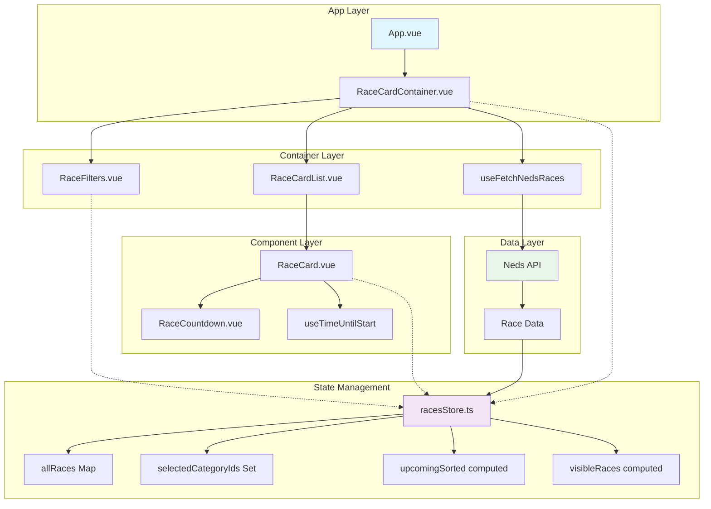

# Next To Go Races - Vue.js Application

A single-page application that displays upcoming horse, harness, and greyhound races using the Neds API. The app shows 5 races at all times, sorted by start time, with real-time countdown timers and category filtering.

## 🏁 Features

- **Real-time Race Display**: Shows 5 upcoming races sorted by start time
- **Category Filtering**: Toggle between Greyhound, Harness, and Horse racing
- **Live Countdown Timers**: Real-time countdown to race start with colour-coded urgency
- **Automatic Race Removal**: Races disappear 1 minute after they start
- **Responsive Design**: Clean, modern UI with smooth animations
- **Type Safety**: Full TypeScript support with proper type definitions

## 🏗️ Architecture Overview

The application follows Vue 3 Composition API patterns with Pinia for state management and Vue Query for data fetching.

### Component Architecture



### Data Flow

1. **Data Fetching**: `useFetchNedsRaces` fetches race data from Neds API
2. **State Management**: Data flows into `racesStore` via `upsertRaces`
3. **Filtering & Sorting**: Store computes filtered and sorted race lists
4. **Component Rendering**: Components subscribe to store state reactively
5. **User Interactions**: Filter changes update store, triggering re-renders
6. **Race Lifecycle**: Countdown timers automatically remove expired races

## 📁 Project Structure

```
src/
├── components/
│   ├── race-card/
│   │   ├── RaceCard.vue          # Individual race display
│   │   └── RaceCardList.vue     # List container with animations
│   ├── race-card-container/
│   │   └── RaceCardContainer.vue # Main container component
│   ├── race-countdown/
│   │   └── RaceCountdown.vue    # Countdown timer with colour coding
│   └── race-filters/
│       └── RaceFilters.vue      # Category filter checkboxes
├── composables/
│   ├── useFetchNedsRaces.ts     # API data fetching
│   └── useTimeUntilStart.ts     # Countdown timer logic
├── stores/
│   └── racesStore.ts            # Pinia store for race state
├── utils/
│   └── constants.ts             # App configuration and constants
└── types/
    └── race-summary.ts          # TypeScript type definitions
```

## 🔧 Key Components Explained

### RaceCardContainer.vue

The main container that orchestrates the entire application:

- Fetches data using `useFetchNedsRaces`
- Manages loading and error states
- Renders filters and race list
- Updates store when new data arrives

### racesStore.ts

Central state management using Pinia:

- **allRaces**: Map storing all fetched races by ID
- **selectedCategoryIds**: Set of active filter categories
- **upcomingSorted**: Computed property for filtered/sorted races
- **visibleRaces**: Computed property limiting to 5 races

### useTimeUntilStart.ts

Handles countdown logic and race lifecycle:

- Updates countdown every second
- Shows "Race Started" when time expires
- Schedules race removal after 1-minute grace period
- Cleans up intervals to prevent memory leaks

### RaceCountdown.vue

Visual countdown display with urgency indicators:

- **Green**: More than 1 minute remaining
- **Yellow**: 30 seconds to 1 minute remaining
- **Red**: Less than 30 seconds remaining

## 🎯 Technical Requirements Met

✅ **Single page application** using Vue.js  
✅ **Displays 'Next to go' races** using Neds API  
✅ **Shows 5 races at all times** with proper limiting  
✅ **Races sorted by time ascending** (earliest first)  
✅ **Race disappears after 1 min past start time** (grace period)  
✅ **Shows meeting name, race number, and countdown timer**  
✅ **Toggle race categories** with proper filtering  
✅ **Correct category IDs** as specified  
✅ **Uses Vue.js framework** with modern patterns

## 🚀 Getting Started

### Prerequisites

- Node.js 16+
- npm or yarn

### Installation

```bash
# Install dependencies
npm install

# Set up environment variables
cp .env.example .env.local
# Add your Neds API URL to .env.local
```

### Development

```bash
# Start development server
npm run dev

# Type checking
npm run type-check

# Linting
npm run lint
```

### Production Build

```bash
# Build for production
npm run build

# Preview production build
npm run preview
```

## 🧪 Testing

```bash
# Run unit tests
npm run test:unit

# Run tests with coverage
npm run test:coverage
```

## 📦 Dependencies

### Core

- **Vue 3**: Modern reactive framework
- **TypeScript**: Type safety and better DX
- **Vite**: Fast build tool and dev server

### State Management

- **Pinia**: Vue 3 state management
- **Vue Query**: Server state management and caching

### UI Components

- **WebAwesome**: Component library for consistent styling

## 🔄 Race Lifecycle

1. **Fetch**: Race data fetched from Neds API
2. **Store**: Data stored in Pinia store with unique IDs
3. **Filter**: Races filtered by selected categories
4. **Sort**: Races sorted by start time (ascending)
5. **Display**: Top 5 races shown in UI
6. **Countdown**: Real-time countdown updates
7. **Start**: Race shows "Race Started" when time expires
8. **Grace**: Race remains visible for 1 minute after start
9. **Remove**: Race automatically removed from display

## 🎨 Styling

The app uses SCSS with scoped styles and follows a component-based approach. Key styling features:

- Responsive design with mobile-first approach
- Smooth transitions for race card animations
- Colour-coded countdown badges for urgency
- Clean, modern card-based layout
- Consistent spacing and typography

## 🔍 Code Quality

- **TypeScript**: Full type safety throughout
- **ESLint**: Code linting and formatting
- **Comments**: Comprehensive Australian English documentation
- **Composition API**: Modern Vue 3 patterns
- **Reactive Design**: Efficient reactivity with computed properties

## 📝 API Integration

The app integrates with the Neds API to fetch race data:

- **Endpoint**: Configurable via environment variables
- **Data Format**: Handles both array and object responses
- **Caching**: Vue Query provides automatic caching and refetching
- **Error Handling**: Graceful error states and loading indicators

## 🤝 Contributing

1. Fork the repository
2. Create a feature branch
3. Make your changes with proper TypeScript types
4. Add tests for new functionality
5. Ensure all tests pass
6. Submit a pull request

## 📄 License

This project is part of a technical assessment and is for demonstration purposes.
# Entain-test-app
